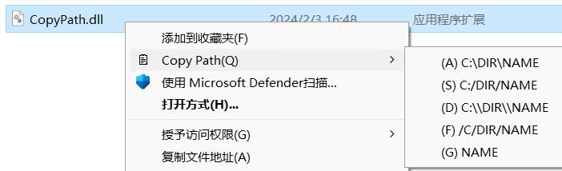

# CopyPath
This is a shell extension for adding a context menu to copy files as paths of different styles.  


## Usage
- Clone this project and build CopyPath.dll with VS2022
- Install via cmd (run as administrator):
```
regsvr32 /i CopyPath.dll
```
- Uninstall:
```
regsvr32 /u CopyPath.dll
```